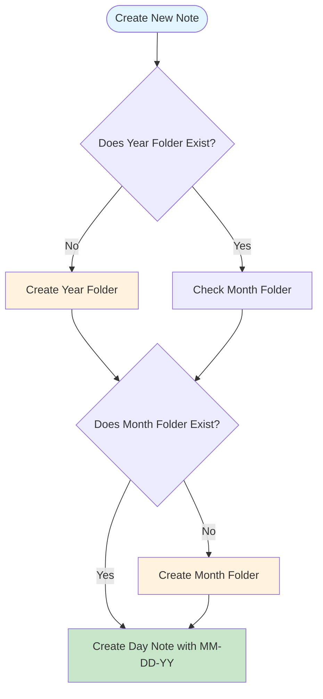

# Background
In 2019, I found myself facing an issue with the future of my note-taking system. In my past note-taking adventures, I relied heavily on Microsoft OneNote and physical lab/engineering notebooks from Bookfactory. But in the modern day, the evolution of working from home and changes to my daily work created a gap. Not every organization utilizes the same software stack when it comes to office productivity software. Years ago you had to choose from various software like Microsoft Office, LibreOffice, Notepad, or even Lotus Notes.


> Q: Do you need a special application to take notes? 

> A: No! Any text editing application can be a note taking tool. 


  
# The Future

##  Struggles With Obsidian

My struggles with the application may not be the same as yours. I ended up running into some, what seems basic, issues that have solutions buried too deep in manuals for add-ons or worse required doing some digging with Google. (That can create its own issues, can anyone say rabbit holes?)So let's dive in on my first pain point : 

## Daily Notes Setup
Any note-taking system you use always has some kind of philosophy about how to do things. I will not tell you this is the *ONLY* way to do something. This method just fits my needs for a day-to-day accounting of what I need. 

My workflows: 

1. A Note for Every Day
2. Create a file structure Matching Year -> Month -> Day
3. Automated!

### Solution

#### Formatting and Structure

Now if you are anything like me you may have been wondering "How can I create the folder structure I want? And won't that take a chunk of my time each year?"  The answer can be as complicated as you want. I ended up spending way more time than I'd care to admit trying to use bash scripts to try and create this file structure each year. It took a lot of keyboard-to-the-head moments to realize I was over-completing things. Using the built-in add-on **Daily Notes** I was able to create a simple structure that fits my needs. However, it was a bit of a pain to wrap my head around to get the results I wanted. 

Lets dive into the settings for the **Daily Notes** add-on. 


In the default settings for **Daily Notes**, each file /note will be created in the root (top level) of your "Vault". 
> "Vault" in Obsidian terms is the folder structure or "notebook" that you setup to store your notes in. 
> Example in windows: C:\Users\YourName\Documents\ObsidianVault
> Example in MacOS: /Users/YourName/Documents/ObsidianVault

Follow the onscreen prompt to "Create new vault" when you first start Obsidian. Save your vault in a location that is easy to find and backup.


After creating your base vault, you can now create a folder in your vault for your daily notes. You can name this whatever you'd like it to be. Just remember the name as you will need to enter it in the settings for the **Daily Notes** add-on, "New File Location" field. Then from the following table examples, you can create your own folder structure and daily note title format. By using the input `YYYY/MM/DD` this will create the folder structure for the year, month, and day. The file name of the note will be the day of the month. "27.md" for example.

Each day you create a note for, will automatically place the note in the correct folder structure. This will help you keep your notes organized and easy to find. When the year or month changes, the add-on will automatically place the note into the correct Year and Month folder. 

Examples: (For the below table we are assuming today's date for the files April 27th 2024)

| Example                                                     | Input                   | Folder Structure Result<br>(/Folder/Folder/File) | Resulting Note Title<br>(File.md) |
| ----------------------------------------------------------- | ----------------------- | ------------------------------------------------ | --------------------------------- |
| Year, Month(Number), Day(Number)                            | YYYY/MM/DD              | /2024/ 04/27                                     | 27                                |
| Year, Month(April),Day(Number)                              | YYYY/MMMM/DD            | /2024/April/27                                   | 27                                |
| Year, Month(Number),Day(Day of Week Abbreviated),           | YYYY/MM/DD-ddd          | /2024/04/27-Sat                                  | 27-Sat                            |
| Year, Month(Num-Abriv),Day(Numer)                           | YYYY/MM-MMM/DD          | /2024/04-Apr/27                                  | 27                                |
| Year, Month(Number),Day(Number),Year                        | YYYY/MM/DD-YYYY         | /2024/04/27-2024                                 | 27-2024                           |
| Year, Month(number),Month(Full),Day(Month,Day,Year Numbers) | YYYY/MM-MMMM/MM-DD-YYYY | /2024/04-April/04-27-2024                        | 04-27-2024                        |


```json
  "format": "YYYY/MM-MMMM/MM-DD-YYYY",
  "template": "My Note Templates/Daily-Notes-Template",
  "autorun": false,
  "folder": "Daily Notes"
```

So, in the end, what does that workflow look like? If we break it down into a flowchart, we can see how things go as you click the "New Note" button or the calendar icon. 


