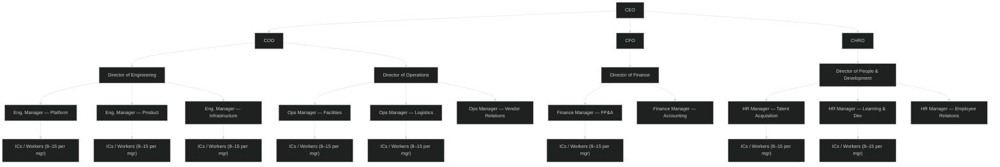

## “The Boardroom” & “The Trustees”

## C-Suite

When I speak of C-suite personnel, I'm talking about the people who hold the traditional C titles — CEO, COO, CFO, CHRO, and so on. They are the face of the organization in large meetings, both internally and externally. They set the direction. And when it comes to hybrid work, they are frequently where the damage originates.

In the early days of COVID-era remote work, a lot of C-suites were quietly enthusiastic about it — not because they believed in flexibility for employees, but because the cost savings were real. Less commercial real estate, lower overhead, fewer facilities expenses. Remote work was a CFO's dream dressed up as a people-first policy. Then something shifted. As return-to-office pressure built — from commercial real estate investors, from boards, from executives who were just plain uncomfortable not being able to see their workforce — the same C-suites that had embraced remote work started mandating people back. And they did it with a logic that doesn't hold up to five seconds of scrutiny.

The argument usually sounds something like: “If I can make it in five days a week, so can you.” I have heard versions of this line from executives in multiple industries. What makes it insulting is not the expectation — it is the assumption underneath it. An executive who says this is typically driving in from a house they own, in a car with lane-assist or a car service billed to the company, with a schedule that bends around their life rather than the other way around. They are not arranging childcare at 7 a.m. They are not staring down a 45-minute commute each way on a salary that makes that commute genuinely expensive. The comparison is not apples to apples. It is a private jet to a bus.

The more egregious version — and this actually happened, publicly, during the 2022 and 2023 RTO waves — is the executive who demanded employees return to the office while personally working from a vacation home, a lake house, or in at least a few documented cases, a boat. A number of high-profile leaders who were vocal about the value of in-person work were themselves logging in from Aspen or the Hamptons while their employees were tracking down parking and paying for gas. That is not a leadership position. That is a class position dressed up as one. The rule applies to everyone except the people making it.

Trust, in this context, is not complicated to define: it is the belief that the people above you are operating by the same standards they are holding you to. When a C-suite executive mandates five days in the office from a second home in a ski town, that trust is gone. And once it is gone at the top, it cascades through every layer below it — Directors, middle managers, and eventually the workers actually doing the work. That is where this post is going.

## Directors

In a larger organization — let's say around 1,200 employees — a Director is a real, load-bearing role. They are not individual contributors anymore, but they are also not setting strategy from a boardroom. They live in the middle of that gap. In practice, a Director typically oversees a span of somewhere between 25 and 100 people when you count the full organizational depth under them — not just the 3 to 6 managers who report directly to them, but everyone those managers are responsible for too. That is not a small thing to hold together.

In smaller organizations, "Director" can mean almost anything. Sometimes it is a title handed to someone who is really just a team lead with a fancier business card and no meaningful increase in authority or pay. That is its own problem worth a separate post. But for this conversation, let's stay with the larger org where the title has real weight.

The financial stakes at this level are significant. Gallup has consistently documented that replacing a single employee costs anywhere from 50% to 200% of that person's annual salary — and that range skews hard toward the top end the higher up the org chart you go. For a Director-level role, the realistic cost of turnover lands around 150% to 200% of their salary when you factor in the recruiting cycle, the ramp-up time for whoever fills the seat, and the institutional knowledge that walks out the door. In a 1,200-person organization, losing two or three Directors in a single year because of a poorly executed RTO mandate is not a people problem. It is a balance sheet problem that most C-suites never bother to calculate before they send the memo.

What makes the hybrid work era particularly brutal for Directors is the dual pressure they sit under. They are accountable to the C-suite for executing on mandates they did not write and often do not agree with. Return-to-office policies, productivity metrics, badge-swipe reports — Directors are frequently the ones handed the policy and told to make it land with their middle managers and teams. At the same time, they are responsible for the human beings below them. They are supposed to be coaching their managers, developing their people, protecting their teams from noise that would slow down the actual work.

Those two obligations do not coexist cleanly in a hybrid environment. A Director who actually listens to their managers hears that the RTO mandate is killing morale. A Director who actually reads the data knows that distributed teams are often outperforming their in-office counterparts on output metrics. But a Director who pushes back on the C-suite with that information is taking a political risk that most organizations quietly punish. So the majority of Directors do what the middle always does: they absorb the pressure from both directions and pass the mandate downward with a thin layer of softer language wrapped around it.

That is where the disconnection deepens. By the time a directive from the C-suite reaches the people doing the actual work, it has passed through a Director who filtered it, a middle manager who translated it, and arrived stripped of whatever original context it had — if it had any. And the Director is often the last person in the chain who could have stopped that from happening, and they didn't, because the organization never gave them the space to.

## Middle Managers

If Directors are caught between the C-suite and reality, middle managers are the ones who get crushed when those two things finally collide.

Middle managers in a hybrid environment are being asked to do something genuinely difficult: build cohesion, maintain accountability, support individual development, and drive team performance — across a workforce that is split between home offices and conference rooms, sometimes on the same call, sometimes not even in the same time zone. That is hard even when an organization sets managers up to succeed. Most don't.

Here is what actually happens. The C-suite announces an RTO policy or a new hybrid attendance framework. The Director passes it down. The middle manager is now the one who has to walk into a 1:1 with a high-performing employee who moved 40 miles away during the pandemic and tell them they need to be in the office three days a week. The manager did not make that policy. They may not even agree with it. But they are the face of it. Their employee's frustration lands directly on them. Their relationship with that person takes the hit, not the executive who drafted the memo.

At the same time, middle managers are increasingly being asked to track attendance, monitor badge swipes, and report on physical presence metrics — none of which have any documented relationship to actual performance. So now the manager who was promoted because they were good at the work is spending part of their week doing something that feels, to them and to their team, indistinguishable from surveillance.

This is not hypothetical dysfunction. Gallup's 2025 State of the Global Workplace report found that manager engagement dropped to 27%, the lowest on record and the steepest decline of any employee group. Microsoft's 2024 Work Trend Index found that 74% of managers say they lack the influence or resources to make meaningful changes for their teams — and that hybrid managers are significantly more likely than in-person managers to report struggling to trust their employees and feeling like they have less visibility into what their teams are actually doing. That last part is worth sitting with for a second. The hybrid model created a visibility problem that organizations then solved by making managers feel like they need to compensate through control. More check-ins, more status updates, more presence requirements. Which pushes the best people out the door faster.

The deeper issue is that most middle managers were never trained to manage in the first place. They were promoted because they were great individual contributors — strong engineers, sharp analysts, high-output project leads. Then they were handed a team and largely left to figure it out. That was always a gap. Hybrid work does not create the gap, it just removes the cover that physical proximity provided. When everyone was in the same building, you could approximate culture through proximity. You could read the room. You could catch someone struggling by noticing they hadn't left their desk for lunch. Hybrid strips all of that away and replaces it with a calendar full of video calls — and most organizations handed their managers nothing to fill that gap with.

The result is a layer of managers who are burned out, under-supported, politically exposed, and increasingly disengaged — managing teams of workers who can sense all of that and are drawing their own conclusions about what it means for their future at the company.

## Workers—the ones actually doing the hard work
These workers are where everything falls apart. they get the most criticism and frequently the most backlash the fastest. When you hear of burn out this is ground zero for it. Especially when it hits with the types of high performers that are expected at these levels before they get put into the tough spot of bieng middle managers. These high performers, like  called out in the[(tiktok  by Craig Willard](https://www.tiktok.com/@craigwillard/video/7622733476852256031?_r=1&_t=ZT-95AV3pqvpj3) are often teh one being pulled in a million directions becase they are being asked questions, being interupted by these chats, questions, dropbys.  THis will make high performers not want to perfomr anymore. How often can you make a high performance engine run high RPMS and constanly switching hears and expect it to never run out. 

How these workers are expected to show up day after day and time after time, constantly getting the living tar beat out of them?  The asnwer is shockingly easy. They eventually stop showing up and there isnt much anyone can do about it. becase once they leave they are gone and most organizations will hardly seem them comback anytime soon. 
Do managers really expect them to come back each time they leave? Is that somethign that is always doable, no its not. 
when you look at these workers they are often the one that have the difficult time in doing work. They offten will suffer from burnout, stress, and a lack of motivation due to the constant pressure and interruptions they face. this by definitiion is the loss of psychological safety.

> [psychological safety is the belief that one will not be punished or humiliated for speaking up with ideas, questions, concerns, or mistakes. - Dr. Amy Edmondson](https://journals.sagepub.com/doi/10.2307/2666999)
<!-- TODO: Citation note — the link above points to the original 1999 paper "Psychological Safety and Learning Behavior in Work Teams," published in Administrative Science Quarterly (not Harvard Business Review). The quote and attribution to Dr. Amy Edmondson are accurate. If you prefer to link to a more accessible source, consider the 2019 HBR podcast/article (https://hbr.org/podcast/2019/01/creating-psychological-safety-in-the-workplace) or the Harvard DASH repository version of the paper (https://dash.harvard.edu/entities/publication/13a7b031-0fdd-45ec-a7e0-2b80e2bc679f). -->