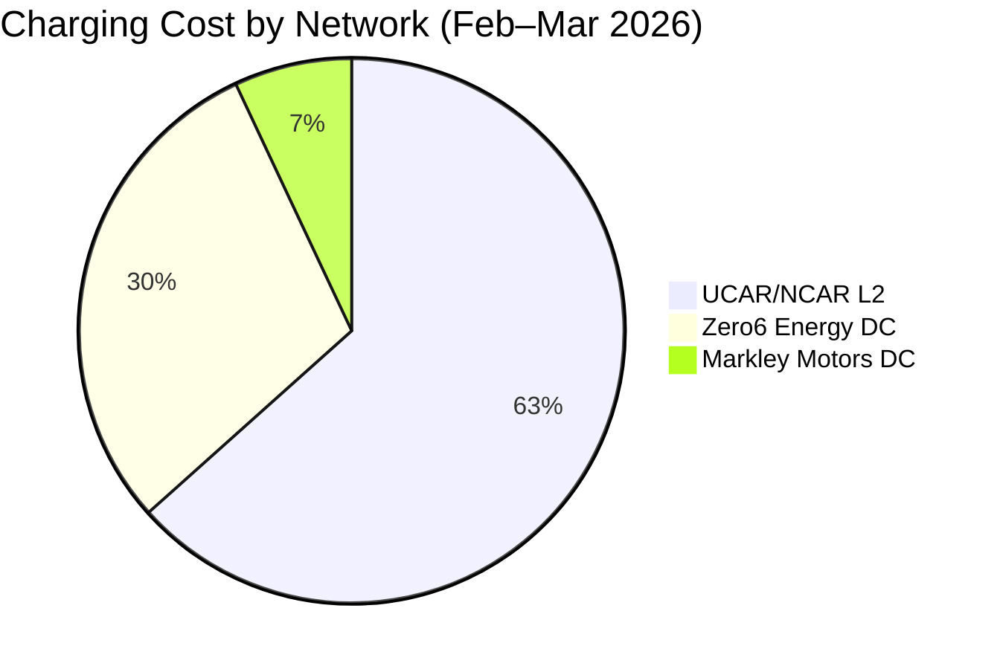
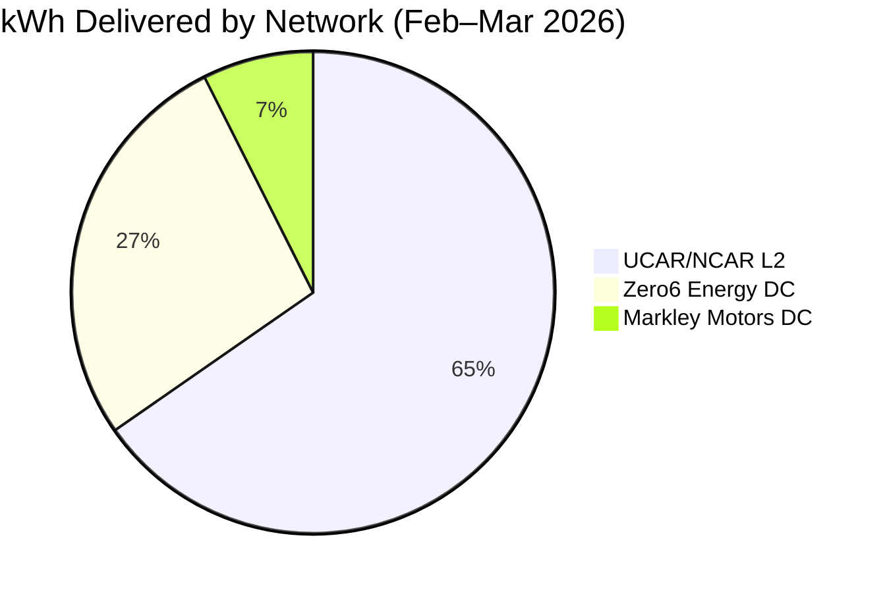

I pulled two months of my ChargePoint session history and ran the numbers so you don't have to. If you own an EV in Colorado — especially a Subaru Solterra — and you're wondering what public charging is actually costing you and whether the DC fast chargers are worth it, here's the data.

This isn't a theoretical comparison. These are my real sessions from February and March 2026, across three networks and four locations in the Denver-Boulder-Fort Collins corridor.

## The Data at a Glance

**20 sessions. 516 kWh delivered. $246.80 spent.**

| Network | Sessions | Total kWh | Total Cost | Avg $/kWh | Typical Speed | Charger Type |
|---|---|---|---|---|---|---|
| UCAR/NCAR (Boulder) | 14 | 337.10 | $156.42 | $0.46 | ~5.8 kW | L2 |
| Zero6 Energy (Longmont) | 5 | 140.69 | $73.15 | $0.52 | ~50 kW | DC Fast |
| Markley Motors (Fort Collins) | 1 | 38.30 | $17.23 | $0.45 | ~51 kW | DC Fast |

The story those three rows tell is pretty clear: L2 charging at work is by far the cheapest option per kWh, and it accounts for the majority of my total energy delivered. The DC fast chargers are more expensive and get used when I need a quick top-up between stops rather than a slow soak.

## Cost Breakdown by Network

## Energy Delivered by Network

The cost and kWh pies look almost identical in shape, which tells you something useful: no single network is dramatically more or less efficient per session — the difference in total spend is mostly explained by how often I use each one, not by wildly different rates.

## UCAR/NCAR ChargePoint — The Workhorse

Fourteen of my twenty sessions were at UCAR/NCAR ChargePoint stations in Boulder — the MESA LAB and FOOTHILLS LAB locations. These are Level 2 chargers delivering right around 5.8 kW on average, which is exactly what you'd expect from a 240V L2 station with the Solterra's 6.6 kW onboard AC charger as the limiting factor.

The economics here are hard to beat. At an average of **$0.46/kWh**, I got 337 kWh for $156. For context, my home Xcel Energy rate runs around $0.13/kWh — so I'm paying about 3.5x home rate at these stations. That sounds bad until you realize I'm parked at work anyway. The charger is doing its thing while I'm in meetings. These aren't destination charging stops; they're background charging.

The sessions are long — regularly 3 to 7 hours — because the car is parked for a full workday. You're not racing to top off; you're just leaving the car plugged in while you work. The longest single session in this window was 7 hours 7 minutes for 39.6 kWh at $28.68. That's a nearly full charge on a car that was sitting in a parking lot doing nothing else.

One thing worth noting: the rate structure at UCAR/NCAR appears to shift. My February 23rd session — 7h 7m, 39.6 kWh — cost $28.68, which works out to $0.72/kWh. That's well above the network average and stands out as an outlier. Whether that was a rate increase, a time-of-use pricing window, or something else in the billing, I'm not sure. It's a reminder to keep an eye on what you're being charged per session rather than assuming consistency within a single network.

> If you have access to workplace L2 charging, use it. It's the highest-volume, lowest-hassle charging you'll find.

## Zero6 Energy / In-N-Out Longmont — The DC Fast Charger Reality

The five sessions at the In-N-Out location in Longmont are a different story. These are DC fast chargers, and the speeds prove it: sessions ranged from 38.7 kW to 78.0 kW of delivered power.

That top session — 34.7 kWh in 26 minutes, implying ~78 kW — stands out. The Solterra's official DC fast charge limit is 50 kW. So how did a session deliver power at a rate equivalent to 78 kW? The most likely explanation is that the car accepted a higher initial charge rate at low state of charge before the battery management system throttled back. The Solterra, like most EVs, will accept more power when the battery is cold and depleted, then taper as it fills and warms up. When you average across the whole session, the apparent rate reflects that ramp-down. The 78 kW figure is the implied average across 26 minutes — meaning the peak was likely higher, tapering down fast.

The rate here is **$0.52/kWh** on average, which is 13% more expensive than the UCAR L2 sessions. The trade-off is obvious: you can put 34–47 kWh into the car in under an hour. When I'm on the road between Denver and Fort Collins, a 25-minute stop beats a 4-hour stop every time.

The Solterra's 50 kW DCFC ceiling is the real limitation at these stations. The chargers are capable of more. The car is the bottleneck. If you're used to a Tesla or a Hyundai Ioniq charging at 150–350 kW, the Solterra's DCFC experience will feel slow by comparison. It's fine for a mid-trip top-up; it's not practical as your primary charging strategy.

## Electrify America — [Placeholder: Add Screenshots from EA App]

> EA does not export session data the way ChargePoint does, so this section needs to be filled in manually from the Electrify America app.
>
> **To complete this section:** Open the EA app, pull up your session history, and screenshot the relevant sessions. Add the data here: dates, kWh delivered, cost, and session duration.

What I can say from experience without the data export:

Electrify America stations in Colorado are more geographically distributed than ChargePoint, which makes them useful for longer highway trips. The problem with the Solterra specifically is that some EA stations appear to throttle the Solterra to around 10 kW on certain DCFC connections — well below the car's 50 kW capability and well below what the hardware is rated to deliver.

This is not a ChargePoint issue; it appears to be specific to how the Solterra's charging protocol negotiates with certain EA stations. The result is that you sit at what looks like a 150 kW pedestal and get L2-equivalent speeds. It is exactly as frustrating as it sounds. Until Subaru pushes a firmware fix or EA updates their station software, your best bet on EA with a Solterra is to confirm the session is actually delivering at speed before walking away from the car.

## What I Actually Pay Per Mile

The Solterra's EPA-rated range is approximately 222 miles on a 71.4 kWh usable battery. That works out to an efficiency of **0.322 kWh per mile** under EPA conditions.

Using that efficiency figure and the real-world rates from my data:

| Source | Rate | Cost Per Mile |
|---|---|---|
| Home (Xcel Energy) | ~$0.13/kWh | ~$0.042/mile |
| UCAR/NCAR L2 | $0.46/kWh | ~$0.148/mile |
| Zero6 Energy DC | $0.52/kWh | ~$0.167/mile |
| Blended public average | $0.48/kWh | ~$0.154/mile |

For comparison, a gasoline SUV getting 28 mpg at $3.20/gallon costs about **$0.114/mile** in fuel. So at home charging rates, the Solterra is dramatically cheaper to run than any gas vehicle. At public L2 rates, it's roughly comparable. At DC fast charger rates, you're paying more per mile than a reasonably efficient gas car.

The takeaway: **home charging wins**. Public L2 at work is a close second if you can get it. DC fast charging is a convenience service, not a cost-savings strategy. If you're relying exclusively on public DC fast chargers because you don't have home charging access, an EV may not pencil out economically compared to a hybrid.

## Tips for Colorado ChargePoint Users

Based on two months of daily use in the Boulder-Denver-Fort Collins corridor:

- **Treat workplace L2 as your primary charge.** If your employer has ChargePoint L2 stations, use them religiously. The cost per kWh is reasonable and the time cost is zero since you're there anyway.
- **Watch for rate anomalies on UCAR/NCAR stations.** Most sessions ran $0.14–$0.25/kWh in effective cost, but a few hit $0.72/kWh. Check your session receipt before you leave.
- **The Longmont DC fast chargers are solid for a quick top-up.** The hardware can push past 50 kW, and the Solterra will accept it at low state of charge. Budget 25–40 minutes for a meaningful charge.
- **DC fast charging math: it's a convenience premium, not a cost win.** At $0.52/kWh, you're paying ~67% more per kWh than the L2 sessions. That premium is worth it when you need speed. It's not worth it when you have time.
- **Download the ChargePoint app and enable session receipts.** Having a per-session email with kWh, cost, and duration makes the accounting straightforward. The CSV export (under Account > Charging History) is clean and importable into a spreadsheet.
- **Colorado altitude affects real-world range.** EPA range figures are tested at sea level. In the mountains or on I-70 grades, expect meaningful range reduction. Don't chase DC fast chargers on a tight margin in the mountains.

## Bottom Line

Two months of data, 20 sessions, and $246.80 later: public charging in Colorado is workable but not cheap. The economics depend almost entirely on whether you have access to workplace or home L2 charging. If you do, your cost per mile is hard to beat. If your only option is public DC fast charging, the math gets a lot tighter.

The Solterra is a capable daily driver in this environment. Its 50 kW DCFC ceiling is a real limitation on long trips, but for a mostly local/regional use case with access to L2 charging during the day, it works well. The EA throttling issue is a legitimate bug that needs a fix — once you've sat at a "150 kW" station delivering 10 kW for 45 minutes, you don't forget it.

More EV coverage on this blog: if you're just getting started with EV ownership and want the broader picture on charging types, infrastructure, and what to expect, check out [Electric Car Things — A Guide]().
