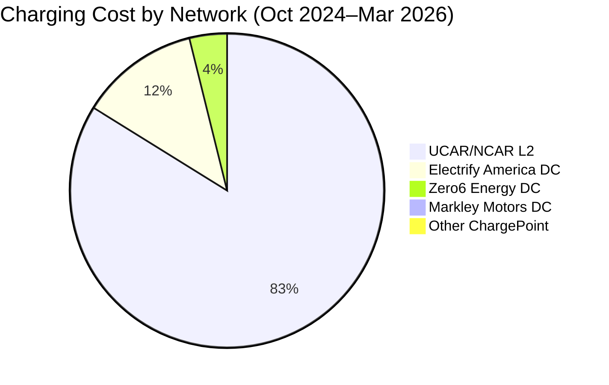
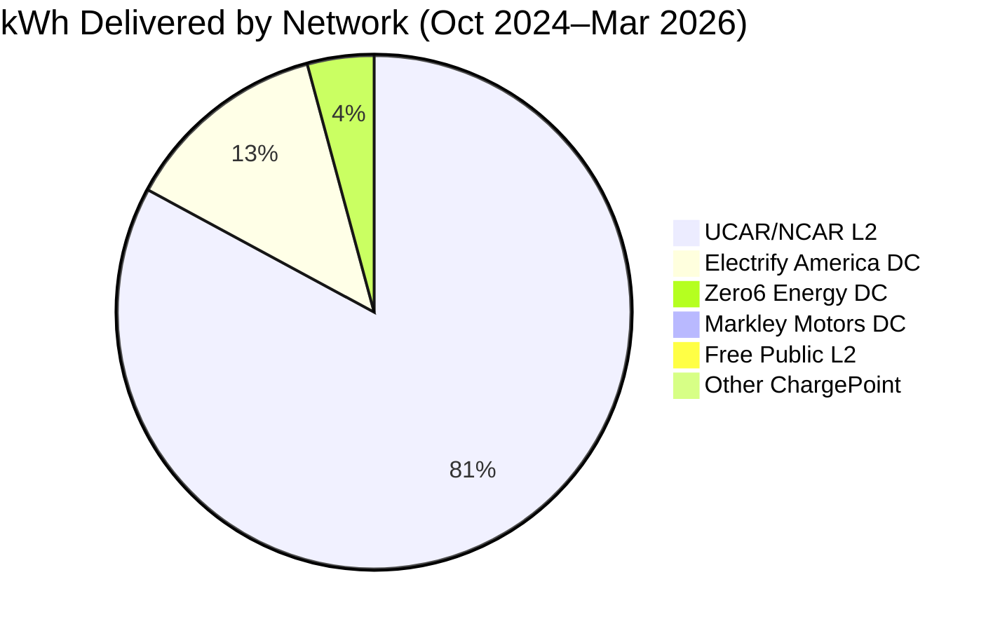
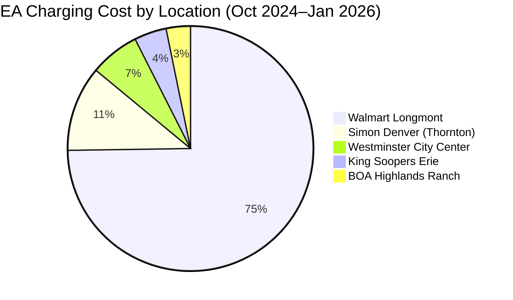
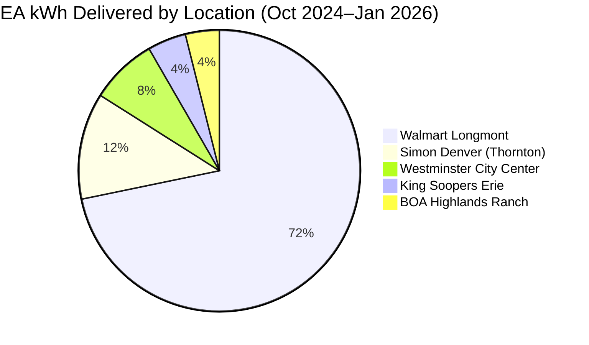

I pulled 17 months of ChargePoint and Electrify America session history and ran the numbers so you don't have to. If you own an EV in Colorado like me with  my  Subaru Solterra ' 24 and you want to know what public charging actually costs, whether the DC fast chargers are worth it, and whether EA is as unreliable as people say, here's the data.

This isn't a theoretical comparison. The ChargePoint data covers October 2024 through March 2026 an amazing 127 sessions across five operators and a dozen locations in the Denver-Boulder-Fort Collins corridor. The Electrify America data runs October 2024 through January 2026, 26 sessions at five Colorado locations. Same car, same roads, 17 months of real receipts. Its also worth noting that I also have an Electrify America subscription, to try and unlock lower per kWh cost rates.

Also worth calling out before we get into the numbers: this entire dataset is built on 100% public charging. No home charging at all during this window. Part of that was a deliberate choice to see what the public network could actually handle. Part of it is a practical reality that does not come up enough in EV reviews. The cable that comes with the Solterra from the dealership is a standard 120V Level 1 cord, and in my experience those cables are too short to be useful unless you can charge in a garage. If your home is not pre-wired for a 240V EV circuit and you do not have a garage setup, that factory cable is not going to cut it for daily driving. Getting a proper home Level 2 setup means either having a pre-wired garage or bringing in an electrician to run new service. Not everyone has that option. This whole experiment was built around what it looks like when you rely entirely on public infrastructure instead.

**ChargePoint (Oct 2024–Mar 2026): 127 sessions. ~3,373 kWh paid + 22 kWh free. ~$1,899 spent.**
**Electrify America (Oct 2024–Jan 2026): 26 sessions. 491 kWh. $263.25 spent.**

## The Data at a Glance

| Network | Sessions | Total kWh | Total Paid | Avg $/kWh | Charger Type |
|---|---|---|---|---|---|
| UCAR/NCAR (Boulder) | 108 | 3,150.59 | $1,794.88 | $0.57 | L2 |
| Zero6 Energy (Longmont) | 6 | 159.32 | $82.84 | $0.52 | DC Fast |
| Markley Motors (Fort Collins) | 1 | 38.30 | $17.23 | $0.45 | DC Fast |
| Electrify America | 26 | 490.95 | $263.25 | $0.54* | DC Fast |
| Free public (Boulder County + VTP) | 5 | 22.17 | $0.00 | — | L2 |

*EA TotalCost includes Colorado sales tax; ChargePoint costs are pre-tax. Stripping an estimated ~8% Colorado blended tax from EA brings the pre-tax rate to approximately $0.50/kWh — comparable to ChargePoint DC fast charging once you normalize.

The L2 picture is clear: workplace charging is far cheaper per kWh than anything else on the list, and over 17 months it accounts for the overwhelming majority of total energy delivered. The DC fast chargers — both ChargePoint and EA — are converging on $0.50–0.57/kWh depending on how you account for tax, which means they're running more expensive per mile than a reasonably efficient gas vehicle. More on that in the cost-per-mile section.

## Cost by Network (All Paid Sessions)

## Energy Delivered by Network

The cost pie makes one thing immediately obvious: UCAR/NCAR L2 charging dominates both spending and energy delivered. Everything else is rounding error by comparison. That's mostly a function of having access to workplace charging five days a week — if you don't have that, your pie looks very different.

## UCAR/NCAR ChargePoint: The Workhorse

Over 17 months, 108 paid sessions at UCAR/NCAR ChargePoint stations in Boulder — primarily MESA LAB, with occasional use of FOOTHILLS LAB, CENTER GREEN, and the RAF station in Broomfield. These are Level 2 chargers delivering right around 5.8 kW on average, which is exactly what you'd expect from a 240V L2 station up against the Solterra's 6.6 kW onboard AC charger.

**108 sessions. 3,150.59 kWh. $1,794.88. $0.57/kWh average.**

The $0.57/kWh blended rate is the figure that needs context, because it doesn't tell the whole story. Looking at the data by period, the effective rate has varied considerably:

| Period | kWh | Cost | Effective $/kWh |
|---|---|---|---|
| Oct–Dec 2024 | 425.30 | $206.95 | $0.49 |
| Jan–Jun 2025 | 1,269.16 | $768.39 | $0.61 |
| Jul–Dec 2025 | 973.59 | $589.76 | $0.61 |
| Jan–Mar 2026 | 482.54 | $229.78 | $0.48 |

The late-2024 and early-2026 sessions average around $0.48–0.49/kWh. The middle of 2025 runs consistently at $0.60–0.61/kWh. This isn't a simple rate increase — the sessions themselves tell a partial story. Summer 2025 sessions are longer (regularly 7–8 hours, often delivering 44–48 kWh) and frequently appear to hit higher time-of-use pricing bands. Some individual sessions in that window hit $0.72–0.80/kWh effective rates. Whether the UCAR station operator changed their pricing tiers, whether these longer sessions are crossing into evening peak hours, or whether something changed in the ChargePoint rate structure for this network is something I haven't been able to definitively confirm — but the pattern is real and shows up consistently across multiple sessions in that window.

The sessions themselves are straightforward: park at work, plug in, come back 3–8 hours later, repeat. The longest single session in the full dataset was 8 hours 15 minutes for 44.1 kWh at $36.57 on June 3, 2025. That's a nearly full charge on a car that sat in a parking lot while I was in meetings.

For context: City of Longmont Power runs around $0.1057/kWh at home, so even the cheapest UCAR sessions are running about 4.5x home rate. That sounds bad until you remember the time cost is zero. The charger works in the background; I do not.

> If you have access to workplace L2 charging, use it. It is the highest-volume, lowest-hassle, and most cost-stable charging option available.

## Zero6 Energy / In-N-Out Longmont: The DC Fast Charger Reality

Six sessions at the In-N-Out location in Longmont over the same 17-month window. These are DC fast chargers, and the session numbers prove it.

**6 sessions. 159.32 kWh. $82.84. $0.52/kWh average.**

Session-level data:

| Date | Duration | kWh | Cost | Implied Avg kW |
|---|---|---|---|---|
| 1/2/2026 | 22m 52s | 18.635 | $9.69 | 48.9 kW |
| 2/10/2026 | 34m 39s | 27.871 | $14.49 | 48.2 kW |
| 2/14/2026 | 24m 9s | 15.738 | $8.18 | 39.1 kW |
| 3/7/2026 | 22m 44s | 14.667 | $7.63 | 38.7 kW |
| 3/16/2026 | 56m 47s | 47.672 | $24.79 | 50.4 kW |
| 3/21/2026 | 26m 43s | 34.737 | $18.06 | 78.0 kW |

That March 21st session stands out — 34.7 kWh in 26 minutes at an implied average of 78 kW. The Solterra's DC fast charge ceiling is 100 kW. The most likely explanation for the apparent high average is that the car accepted a higher initial charge rate at low state of charge, then tapered down as the battery filled and warmed up. The 78 kW figure is an average across 26 minutes; the peak was almost certainly higher at the start and dropped from there.

At $0.52/kWh, these sessions cost 9% less than EA and are considerably more predictable. Every session completed, no aborts, no throttling events. The trade-off versus L2 is straightforward: these sessions cost about $0.04–0.09/kWh more than the UCAR L2 sessions but deliver in 25–57 minutes instead of 3–8 hours. When the route requires it, the math is obvious.

## Electrify America: More Data, More Variance

The EA dataset covers 26 sessions from October 2024 through January 2026 — a 15-month window across five Colorado locations. The headline numbers look similar to ChargePoint DC fast charging at first glance: 491 kWh delivered, $263.25 spent, $0.54/kWh average. But the averages don't tell the real story here. The variance does.

### Sessions by Location

| Location | City | Sessions | Total kWh | Total Cost | Max kW Range |
|---|---|---|---|---|---|
| Walmart 5370 | Longmont | 20 | 352.28 | $196.82 | 30–81 kW |
| Simon Denver Premium Outlets | Thornton | 3 | 60.03 | $29.64 | 32–76 kW |
| Westminster City Center | Westminster | 1 | 37.77 | $17.19 | 94 kW |
| BOA COW-066 | Highlands Ranch | 1 | 19.14 | $8.42 | 94 kW |
| King Soopers | Erie | 1 | 21.73 | $11.18 | 89 kW |

Longmont Walmart is the workhorse — 20 of 26 sessions, which reflects proximity to home and commute routes more than any strong preference for that station.

### EA Cost Breakdown (Oct 2024–Jan 2026)

### EA Energy Delivered (Oct 2024–Jan 2026)

### The Charging Speed Problem

Here is the number that should be on every EA review you read: **the MaxChargingRate across these 26 sessions ranged from 30 kW to 94 kW. Same car. Same network. Same connector.** You have essentially no way of knowing which end of that range you'll land on when you plug in.

For reference, here are some notable sessions showing that spread:

| Date | Location | Max kW | kWh | Duration | Notes |
|---|---|---|---|---|---|
| 2025-07-05 | BOA Highlands Ranch | 94 kW | 19.14 | 13m 12s | Clean, fast, no drama |
| 2025-07-18 | Walmart Longmont | 79 kW | 19.94 | 16m 30s | Good session |
| 2025-06-30 | Walmart Longmont | 93 kW | 24.86 | 16m 53s | Good session |
| 2025-05-03 | Westminster City Center | 94 kW | 37.77 | 29m 7s | Best single session |
| 2025-12-31 | Walmart Longmont | 45 kW | 32.19 | 55m 39s | Moderate — car or station issue |
| 2026-01-31 | Walmart Longmont | 49 kW | 41.25 | 1h 15m 45s | Slow for the energy delivered |
| 2025-03-29 | Simon Denver (Thornton) | 32 kW | 24.51 | 1h 10m 20s | Throttled — see below |

The difference between a 94 kW session and a 32 kW session isn't just speed — it's 45 minutes of your life. You plug in expecting a 20-minute top-up and end up sitting there for over an hour.

### The Throttling Incident: March 29, 2025 — Simon Denver (Thornton)

This is the EA/Solterra compatibility bug documented in real numbers, not forum speculation.

On March 29, 2025, I plugged into an EA station at Simon Denver Premium Outlets in Thornton. The pedestal is rated for 150 kW. The Solterra's DCFC limit is 100 kW. What I actually got: a **32 kW peak** and an average delivery rate of approximately 21 kW across 70 minutes, for 24.51 kWh at a cost of $11.16.

At the Solterra's normal 50–100 kW acceptance rate, that same 24.51 kWh would have taken 15–30 minutes. Instead it took over an hour.

This is not a fluke or a bad cable. It's a known compatibility issue between how certain EA station firmware negotiates the charging session and the Solterra's charging protocol. The session starts, the car and charger handshake, and somewhere in that negotiation the power delivery gets capped far below what either the car or the charger is capable of. Subaru has been aware of this. The fix has been slow to arrive.

> **The practical lesson:** any time you plug into an EA station with a Solterra, watch the charging rate on your dash for the first two minutes. If it's showing under 20 kW on a DCFC pedestal, unplug and try a different stall — or leave and find another network. Do not assume the session will speed up. In my experience, if it starts slow, it stays slow.

### The Charger-Hopping Incident: May 17, 2025 — Walmart Longmont

This one is its own category of frustrating. On May 17, 2025, I pulled into the Walmart Longmont EA station and tried four separate pedestals in the span of about eight minutes. All four sessions aborted within 1–2 minutes of starting.

| Attempt | Max kW | kWh Delivered | Duration | Cost Charged |
|---|---|---|---|---|
| 1 | 90 kW | 1.44 kWh | 1m 26s | $0.73 |
| 2 | 89 kW | 1.44 kWh | 1m 23s | $0.73 |
| 3 | 89 kW | 1.44 kWh | 1m 26s | $0.73 |
| 4 | 86 kW | 1.54 kWh | 1m 54s | $0.78 |

**Total: $2.97 charged. ~5.86 kWh delivered. No usable charge. I drove away and found a ChargePoint station.**

What makes this especially aggravating is the MaxChargingRate data. All four pedestals reported 86–90 kW of initial rate — so the hardware was communicating. Something in the session initialization was causing each one to terminate almost immediately. Whether it was a station-side firmware issue, a network outage affecting the payment authorization, or something in the car's state at that moment, I have no definitive answer. What I do know is that EA billed me for all four attempts. And when you have to have an active method on any EV Charger provider's network. this can get especially annoying as this will eat up your finances.

### The Aborted Session Tax

Across all 26 EA sessions, **6 were effectively aborted** — delivering under 2 kWh and terminating in under 5 minutes. This includes the May 17 incident plus two additional single-session failures on July 10 and July 18, 2025.

Total cost for those 6 sessions: **$4.84** for **8.66 kWh** of energy that didn't meaningfully move the charge needle. That's not catastrophic in dollar terms, but it represents sessions where you showed up, plugged in, waited, got almost nothing, and had to figure out a plan B.

### When EA Actually Works

It's worth being balanced here, because the bad sessions are memorable and the good ones are easy to forget.

The Westminster City Center session on May 3, 2025 — 37.77 kWh in 29 minutes at 94 kW — was as good as DC fast charging gets on a Solterra. For that trip being a late night trip and not to mention ambiant temp around 60F, that session was quite the positive and most fitting "ideal charging time" on an Electrify America charger.  The BOA Highlands Ranch (Electify America) session on July 5, 2025 — 19.14 kWh in 13 minutes at 94 kW — was almost absurdly fast, during which the car battery was very cooled down after a journey down the I-25 corridor and resting at a destination for 4+ hours. The King Soopers Erie session in April 2025 hit 89 kW and finished cleanly.

When EA works, it is fast and the network coverage is genuinely better than ChargePoint for highway travel. The stations I mentioned above had no drama, no throttling, no aborts. Plug in, charge, go.

The problem is you don't know which experience you're going to get until you're already there. That uncertainty has a real cost — in time, in stress, and occasionally in dollars.

## Free Public Charging — The Bonus Layer

> Boulder County operates a small network of free public ChargePoint L2 stations at several Longmont locations. Over the same 17-month window, I picked up 5 free sessions totaling **22.17 kWh at $0.00**. That's roughly $12 in avoided charging cost at UCAR rates, or about $15 at Zero6 rates — not life-changing, but worth knowing about.
>
> The Village at the Peaks shopping center in Longmont also has free L2 stations. If you're already planning to park somewhere for 30–60 minutes, plugging in costs nothing and adds a few kWh of range. Free charging won't replace a dedicated charging strategy, but it's a useful supplemental option for local errands.

If you're a Boulder County area resident with an EV, check the ChargePoint app for the Boulder County network before you assume you need to pay. The free stations are real, they work, and on a slow errand they're genuinely useful.

## What I Actually Pay Per Mile

The Solterra's EPA-rated range is approximately 222 miles on a 71.4 kWh usable battery. That works out to an efficiency of **0.322 kWh per mile** under EPA conditions. For comparison, my other vehicle is a 2021 Subaru Ascent, which gets around 26 mpg combined. At $3.20/gallon that works out to roughly $0.123/mile in fuel costs.

Using that efficiency figure and the real-world rates from 17 months of actual sessions:

| Source | Rate | Cost Per Mile | Notes |
|---|---|---|---|
| Home (City of Longmont Power) | $0.10570/kWh | ~$0.042/mile | Cheapest by far |
| UCAR/NCAR L2 (blended) | $0.57/kWh | ~$0.184/mile | ChargePoint, pre-tax |
| Zero6 Energy DC | $0.52/kWh | ~$0.167/mile | ChargePoint, pre-tax |
| EA (pre-tax est.) | ~$0.50/kWh | ~$0.161/mile | Normalized for comparison |
| EA (as billed) | $0.54/kWh | ~$0.174/mile | Includes CO sales tax |
| Blended public average | ~$0.56/kWh | ~$0.181/mile | All paid sessions, both networks |

For comparison, a gasoline SUV getting 28 mpg at $3.20/gallon costs about **$0.114/mile** in fuel. Home charging on the Solterra beats that handily. Everything else on the list costs more per mile than a reasonably fuel-efficient gas vehicle.

The takeaway is direct: **home charging wins**. Running this experiment and relying entirely on public infrastructure produced a lot of useful data, but it also confirmed something pretty clearly: the economics only work if you have access to cheap, slow charging. Workplace L2 is a close second if you can get it, and even at $0.57/kWh blended it is cheaper than DC fast charging. Public DC fast charging, whether ChargePoint or EA, is a convenience service, not a cost-savings strategy. If you have to rely exclusively on public DC fast charging because you lack home or workplace access, the EV cost advantage evaporates compared to a modern hybrid.

## Tips for Colorado EV Owners

Based on 17 months and 153 sessions across both networks:

- **Workplace L2 is the highest-leverage charging you can get.** The kWh/hour is low, but the time cost is zero. If your employer has ChargePoint stations, treat them as your primary charging source.
- **Watch for UCAR rate variance.** Sessions in the $0.60–0.72/kWh range showed up consistently in summer 2025. Check your session receipt before you leave — rates at the same station can vary meaningfully depending on time of day or billing tier.
- **Zero6 Energy DC chargers in Longmont are reliable.** Six sessions, no aborts, no throttling. The hardware pushes past 50 kW and the Solterra accepts it well at low state of charge. Budget 25–55 minutes depending on how much you need.
- **On EA: watch the charging rate for the first two minutes.** If a DCFC session starts under 20 kW, unplug immediately and try another stall or another network. The throttling issue on certain EA stations does not self-correct.
- **Check Boulder County free stations before paying.** If you're running errands in Longmont, the Boulder County and Village at the Peaks free L2 stations are real, working, and cost nothing. Not a strategy, but a useful supplement.
- **DC fast charging is a convenience premium, not a savings tool.** At $0.52–0.54/kWh, you're paying 3.8–4× home rate. Worth it when you need it. Not worth it as a default.
- **Colorado altitude affects real-world range.** EPA figures are tested at sea level. On I-70 grades or in cold mountain weather, plan for meaningfully less range than the displayed estimate. Don't push DC fast charging margins in the mountains.

## Bottom Line

153 sessions, 3,864 kWh, and $2,160 across two networks over 17 months. That's the real picture of public EV charging in Colorado on a Subaru Solterra.

ChargePoint delivered 127 sessions with zero network-level failures. Every session that started completed, including the L2 sessions that ran 8+ hours. The rate variance at UCAR is worth monitoring, but the reliability is not in question.

EA delivered faster peak speeds when everything aligned — and it also handed me a 70-minute throttled session at a 150 kW pedestal, four consecutive aborted sessions in eight minutes at the same station, and six billed charges that delivered essentially nothing. The good sessions are genuinely fast. The bad ones are genuinely bad, and you won't know which you're getting until you're already there.

If you're considering an EV in Colorado and you have reliable access to home or workplace L2 charging, the economics work. If you're relying primarily on public DC fast charging, run the cost-per-mile math against a hybrid before you commit. At $0.52–0.54/kWh on a network that isn't always consistent, the financial case gets thin.

More EV coverage on this blog: if you're just getting started with EV ownership and want the broader picture on charging types, infrastructure, and what to expect, check out [Electric Car Things — A Guide]().
